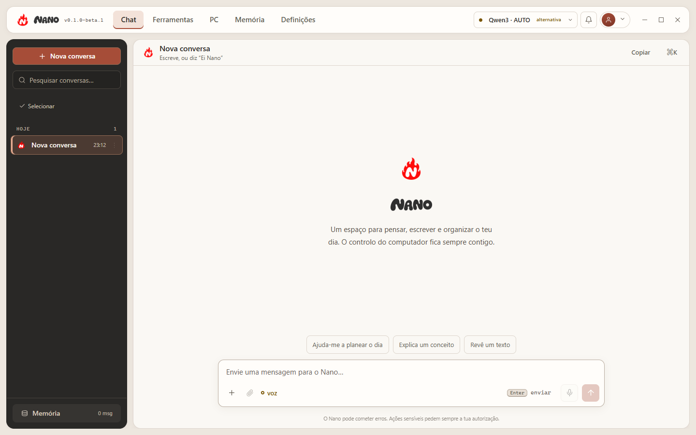
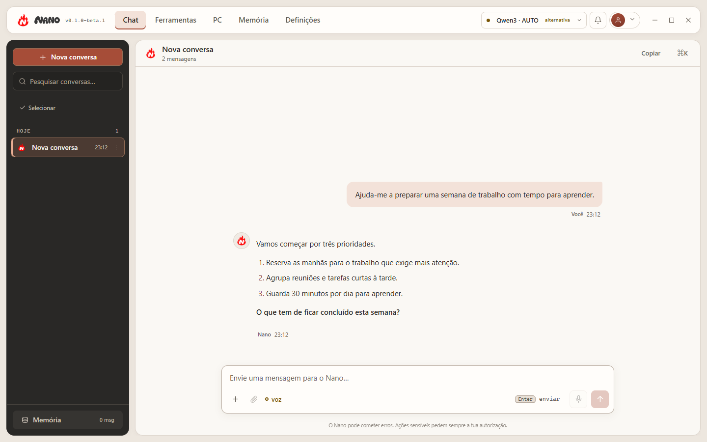
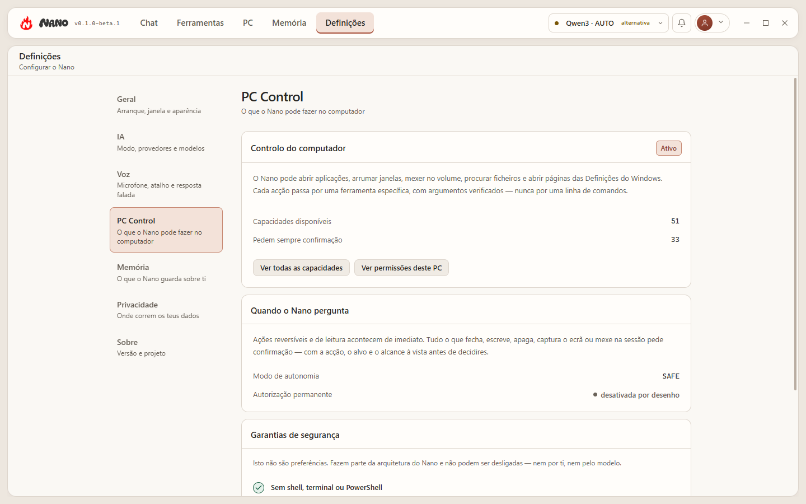
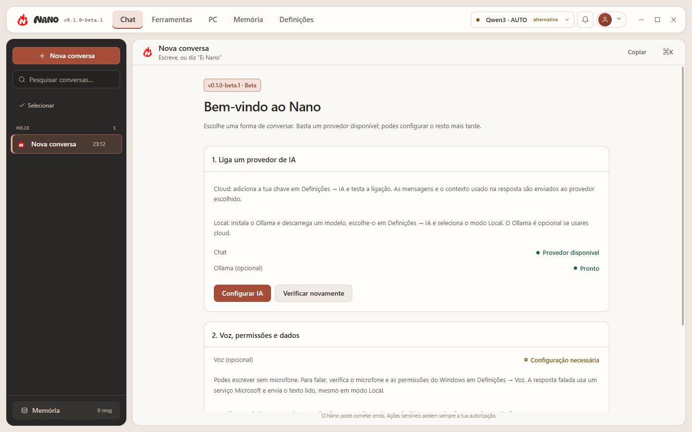

<p align="center">
  
</p>

<p align="center">
  
</p>

<p align="center">
  <strong>Assistente pessoal de IA para Windows: voz, modelos cloud e locais, controlo seguro do PC, conversas com histórico real, memória de longo prazo e arquitetura extensível.</strong>
</p>

<p align="center">
  
  
  
  
</p>

<p align="center">
  <a href="https://github.com/coelho26101009-source/Nano_Assistant/releases/tag/v0.1.0-beta.1"></a>
  
</p>

---

> ### Estado do projeto — Beta pública
>
> **Versão atual: `0.1.0-beta.1`.** Esta é a primeira Beta pública do Nano. Não
> é uma versão estável e não é 1.0. Espera arestas por limar e guarda cópias do
> que for importante para ti.
>
> O `version.json` diz `0.1.0-beta.1`: é a **versão canónica** que a interface,
> a shell Electron, o backend e o instalador leem para não se contradizerem.
> Segue a política pré-1.0 descrita em [`docs/RELEASING.md`](docs/RELEASING.md).
>
> **Os binários não estão assinados.** O Windows pode mostrar um aviso de
> *Editor desconhecido* ou do SmartScreen. Descarrega apenas a partir da página
> de releases oficial deste repositório e confirma o `SHA256SUMS.txt` antes de
> instalar. Não desligues o SmartScreen nem o Defender para instalar o Nano.
>
> **Não existe atualização automática.** As atualizações da Beta são manuais:
> descarrega a versão nova a partir da página de releases.

## Descarregar

<p align="center">
  <a href="https://github.com/coelho26101009-source/Nano_Assistant/releases/tag/v0.1.0-beta.1"><strong>Descarregar o Nano 0.1.0-beta.1 para Windows</strong></a>
</p>

| | |
|---|---|
| **Instalador recomendado** | `Nano-Setup-0.1.0-beta.1-x64.exe` |
| **Sistema** | Windows 10/11 **x64** |
| **Verificação** | `SHA256SUMS.txt`, na mesma página de release |
| **Assinatura** | não assinado — ver o aviso acima |
| **Todas as versões** | [página de releases](https://github.com/coelho26101009-source/Nano_Assistant/releases) |

### Instalar

1. Descarrega `Nano-Setup-0.1.0-beta.1-x64.exe` da página de release.
2. Confirma a soma de verificação (abaixo).
3. Executa o instalador. Se o Windows mostrar *Editor desconhecido*, isso é
   esperado numa Beta não assinada: escolhe **Mais informações → Executar
   mesmo assim** depois de teres confirmado a soma de verificação.
4. Abre o Nano e segue o guia da primeira execução.

Para confirmar a descarga, no PowerShell:

```powershell
Get-FileHash .\Nano-Setup-0.1.0-beta.1-x64.exe -Algorithm SHA256
```

O valor tem de coincidir com a linha correspondente em `SHA256SUMS.txt`.

### A seguir

- **[Guia da Beta](docs/BETA_GUIDE.md)** — primeira execução, ligar um provedor
  de IA, voz, e o que fazer quando algo corre mal.
- **[Privacidade](PRIVACY.md)** — o que fica no teu computador e o que sai dele.
- **[Segurança](SECURITY.md)** — modelo de segurança e como reportar uma
  vulnerabilidade.
- **[Suporte](SUPPORT.md)** — onde reportar erros e colocar dúvidas.

## Como é

<p align="center">
  
</p>

<p align="center">
  
</p>

<p align="center">
  
</p>

<p align="center">
  
</p>

## O que é o Nano?

**Nano** é um assistente pessoal de IA para Windows concebido para viver no
ambiente de trabalho — não apenas numa caixa de chat.

Combina uma aplicação Electron com identidade visual própria, vários provedores
de modelos cloud e um modelo local, voz global através de
**Ctrl + Shift + Space**, conversas persistentes, memória de longo prazo,
ferramentas extensíveis e controlo seguro do Windows. O modelo pode pedir
ações, mas **não recebe autoridade direta sobre o sistema operativo**.

A interface é um espaço de trabalho desktop em tons quentes: superfícies
creme, um rail de conversas em carvão, e um acento terracota usado com
parcimónia. Navegação superior, rail de conversas à esquerda e um overlay de
voz independente da janela principal.

## O que já existe

| Área | Estado atual |
|---|---|
| **Desktop** | Electron, tray, single-instance, interface clara/escura e shell responsiva |
| **IA cloud** | **Groq**, **Mistral** e **Google (Gemini)** |
| **IA local** | Ollama, por omissão `qwen3:8b` |
| **Modos** | AUTO / CLOUD / LOCAL, com uma única autoridade de routing |
| **Failover** | Em AUTO: cloud preferida → restantes clouds → Ollama, sempre visível |
| **Conversas** | Threads reais: criar, abrir, renomear, apagar uma ou várias |
| **Memória** | Memória de longo prazo com extração determinística e recuperação (RAG) |
| **Second Brain** | Nós e relações derivados das memórias ativas |
| **Voz** | Hotkey global, STT local com faster-whisper, TTS através do Edge |
| **PC Control** | 56 ferramentas estreitas: apps, janelas, áudio, teclado, ficheiros, web, ecrã, sistema, energia e capturas |
| **Segurança** | Validação de esquema + PolicyEngine + PermissionManager + ToolExecutor + target binding |
| **Extensibilidade** | Sistema de plugins/tools com autorização centralizada |

---

## Início rápido

### Requisitos

- **Windows 10/11 x64**
- **Python 3.12** — a versão testada no CI e a que o instalador embute
- **Node.js 22.12 ou superior + npm** para Electron/frontend na primeira execução
- dependências Python instaladas com `requirements.txt`
- **Ollama** apenas se quiseres usar os modos AUTO/LOCAL
- uma chave de API de pelo menos um provedor cloud, para AUTO/CLOUD

```bat
python -m pip install -r requirements.txt
```

Para preparar o modelo local usado por omissão:

```bat
ollama pull qwen3:8b
```

Capacidades opcionais (transcrição local, PDF, automação de browser, wake word)
vivem em `requirements-optional.txt` e não são instaladas por omissão.

### Abrir o Nano Desktop

Faz duplo-clique em:

```text
NANO_DESKTOP.bat
```

O launcher valida o Python e as dependências, instala o Electron na primeira
execução, recompila o frontend apenas quando necessário e entrega o controlo à
shell Electron. A janela só aparece depois de o backend estar pronto.

Fechar a janela principal **esconde o Nano no tray** para que a hotkey global
continue disponível. Para sair completamente, usa **Sair do Nano** no menu do
tray.

### Modo navegador

Para desenvolvimento do frontend ou como alternativa ao Electron:

```text
NANO.bat
```

O modo navegador usa o mesmo backend, mas não inclui tray, hotkey global nem
overlay de voz desktop.

---

## Experiência Desktop

- top bar flutuante com navegação por **Chat · Ferramentas · PC · Memória · Definições**
- rail de conversas à esquerda, com pesquisa, seleção múltipla e eliminação
- superfícies creme sobre um rail em carvão, com acento terracota
- tema claro e escuro, com o mesmo sistema de tokens semânticos
- wordmark e marca oficial em toda a aplicação
- ícone próprio no Windows, taskbar e tray
- composer flutuante e responsivo
- animações com suporte para `prefers-reduced-motion`
- layout validado desde 1920×1080 até ao mínimo da janela Electron

---

## Conversas

As conversas são **threads reais**, não um histórico só de leitura.

- criar uma conversa nova, mudar de conversa e continuar a escrever em qualquer
  uma delas;
- abrir uma conversa antiga **reconstrói o contexto do modelo** a partir das
  mensagens e do resumo dessa thread, para que a resposta seguinte seja dada
  contra o histórico certo;
- renomear, arquivar, apagar uma conversa ou apagar várias numa única ação
  confirmada;
- apagar uma conversa remove as suas mensagens, o resumo, os factos da thread e
  as entradas de índice — mas **não** as memórias de longo prazo que dela
  nasceram, que são geridas à parte na Memória.

Cada conversa tem um dono explícito: uma mensagem pertence à thread ativa no
momento em que foi escrita, e não à que estiver aberta quando a resposta chega.

---

## Memória e Second Brain

**Memória de longo prazo.** O que vale a pena guardar é decidido por
`core/memory_extraction.py`, que é **determinístico e local** — não é uma
chamada ao modelo. Uma frase que pediste explicitamente para guardar fica ativa.
Uma frase que o Nano apenas *inferiu* é pontuada: só uma inferência de
confiança alta se torna memória ativa, uma mais fraca fica como candidata inerte
que podes promover, e abaixo disso não é guardado nada. Preferir falhar uma
memória ambígua a guardar uma errada é intencional.

**Recuperação (RAG).** `core/context_composer.py` é o único sítio que decide o
que o modelo sabe sobre o passado: a cauda recente da conversa, o resumo da
parte mais antiga, mensagens relevantes **desta** thread, memórias de longo
prazo relevantes e as entradas do Second Brain a que dizem respeito. Cada secção
tem o seu próprio orçamento de tokens e tudo é desduplicado, para que um facto
repetido em quatro sítios não seja enviado quatro vezes.

**Second Brain.** Nós e relações entre as coisas de que as memórias falam. A
contenção é a escolha de design: um nó só nasce de uma memória ativa ou de uma
ação explícita tua — nunca de texto solto — e uma aresta só é escrita quando
dois nós aparecem na mesma memória.

> **Honestamente:** o Second Brain está implementado e testado, com CRUD, leitura
> do grafo e reconciliação. Não é um grafo de conhecimento maduro e densamente
> povoado — isso vem de uso real prolongado, e ainda não aconteceu.

---

## Modos de IA

O Nano respeita três modos explícitos. Além do modo, existe uma
**cloud preferida** (Definições → IA), que decide qual o provedor cloud a ser
tentado primeiro. São duas definições independentes.

| Modo | Comportamento |
|---|---|
| **CLOUD** | Usa **apenas a cloud preferida**. Não substitui por outro fornecedor e não muda para local. Se falhar, devolve um erro limpo. |
| **AUTO** | Cloud preferida primeiro → restantes clouds pela ordem do sistema → Ollama local como último recurso. |
| **LOCAL** | Usa apenas o Ollama. Nenhum provedor cloud é contactado, nem sequer para uma sonda de estado. |

A ordem das clouds *depois* da preferida é do sistema, não da preferência:

```text
groq → mistral → google → ollama
```

`preferredCloud` decide quem vai primeiro; `CLOUD_PROVIDER_IDS` decide quem vem
a seguir. Podes escolher o Google em primeiro lugar e a ordem restante continua
a ser governada por esse tuplo.

Essa ordem é uma **decisão medida**, exportada em
[`benchmarks/provider_routing/`](benchmarks/provider_routing/README.md), com as
suas ressalvas: uma conta, um dia, uma execução por caso, e o Google
sub-medido por limites de utilização. Não é uma afirmação de que um fornecedor
é objetivamente melhor do que outro.

Em AUTO, o Nano respeita o `Retry-After` real de um 429 e mantém um cooldown por
fornecedor, para não insistir num provedor que sabe estar limitado. O fallback
preserva o mesmo turno, os resultados de tools e as permissões — o
**Execution Ledger** garante que uma ação já executada não é repetida quando o
turno muda de fornecedor.

Mais detalhes: [Model Routing](docs/architecture/MODEL_ROUTING.md)

---

## Voz

A voz faz parte da experiência desktop principal. Pressiona:

```text
Ctrl + Shift + Space
```

para falar com o Nano a partir de qualquer aplicação.

### Speech-to-text

A configuração de produção atual usa:

```text
faster-whisper
model: small
device: cpu
compute_type: int8
language: pt
```

A transcrição é **inteiramente local**: não existe caminho de STT na cloud no
código. O modelo foi escolhido através de benchmark local e usa uma pequena
pista de vocabulário para nomes importantes do ecossistema Nano.

### Text-to-speech

As respostas faladas usam o serviço de voz **Edge da Microsoft**. Isto vale em
**todos os modos, incluindo LOCAL**: o texto a ser lido sai da máquina para ser
convertido em áudio. "Local" refere-se ao modelo de linguagem, não a silêncio
total de rede. Desliga as respostas faladas em Definições → Voz se quiseres que
nada saia. Ver [PRIVACY.md](PRIVACY.md).

### Overlay de voz

O overlay de voz é uma janela Electron própria, sempre no topo e independente da
janela principal. Mostra estados distintos para Listening, Transcribing,
Processing, Speaking, Busy e Error, e continua a funcionar quando a janela
principal está minimizada ou escondida no tray.

Documentação: [Voice](docs/VOICE.md) · [Speech Accuracy](docs/architecture/SPEECH_ACCURACY.md)

---

## PC Control

O Nano interage com o Windows através de **56 ferramentas estreitas e
auditáveis** (as tools com prefixo `pc_`; o registo completo, incluindo memória,
calendário, lembretes e web, tem 84 entradas). A ideia é sempre a mesma:
cobertura larga através de muitas capabilities pequenas, nunca através de um
executor genérico.

### Aplicações e janelas

- procurar e abrir aplicações instaladas — incluindo apps da Microsoft Store
- mudar para uma aplicação já aberta, e listar o que está aberto
- focar, minimizar, maximizar, restaurar e fechar janelas
- mover, redimensionar, centrar e encostar janelas a metades e cantos
- mandar uma janela para outro monitor, ou mantê-la sempre à frente
- minimizar, restaurar ou fechar todas as janelas de uma aplicação

### Som, ecrã e teclado

- consultar e alterar volume, mute / unmute
- reproduzir, pausar e saltar faixas
- ler e alterar o brilho dos monitores que o suportam
- escrever texto e usar atalhos numa janela indicada
- ler, escrever e limpar a área de transferência

### Ficheiros, web e sistema

- abrir pastas conhecidas e documentos seguros
- pesquisar ficheiros de forma limitada
- criar pastas e ficheiros de texto, copiar, mover e mudar nomes
- enviar ficheiros e pastas para a **Reciclagem** (nunca apagar definitivamente)
- abrir endereços e pesquisas no navegador predefinido
- abrir secções das Definições do Windows
- consultar CPU, RAM, disco, GPU, bateria, ligação e armazenamento
- bloquear, suspender, reiniciar, desligar ou terminar sessão
- capturar o ecrã, a janela ativa ou uma janela indicada

Exemplos:

```text
Abre a calculadora
Mete a calculadora à esquerda
Muda para o Discord
Escreve "olá" no Bloco de Notas
Qual é o volume atual?
Baixa o brilho
Abre as definições de som
Abre o YouTube
Cria uma pasta chamada Notas no Ambiente de Trabalho
Como está a memória do computador?
```

O PC Control é **intencionalmente estreito**. Não existe nenhuma tool genérica
de PowerShell/CMD/shell exposta ao modelo, não há terminação de processos, não
há eliminação permanente de ficheiros, e o Nano recusa escrever numa janela de
consola — abrir um terminal e escrever nele seria uma shell montada a partir de
duas ações inofensivas.

Fechar uma janela envia `WM_CLOSE`, a mesma mensagem do botão X. A aplicação
pode recusar, e nesse caso o Nano relata que recusou: "fechei" e "continuou
aberta" são ambas respostas honestas, "fechado" não seria. O resultado é
verificado contra a identidade da janela (handle **e** processo dono), porque um
handle pode ser reciclado por outra janela.

Ações sensíveis pedem sempre autorização, e o cartão de confirmação mostra o
que vai acontecer, a quê e com que alcance.

Documentação: [PC Control](docs/architecture/PC_CONTROL.md)

---

## Segurança

A regra central do Nano é simples: **o modelo pode pedir; o sistema decide e
executa**. O caminho real, tal como está em `core/tool_execution.py`:

```text
MODEL
  ↓
resolução de capability
  ↓
validação de argumentos (esquema registado)
  ↓
classificação de scope / resolução de target
  ↓
PolicyEngine
  ↓
PermissionManager
  ↓
ToolExecutor
  ↓
TOOL ESTREITA → OS
  ↓
RESULTADO VERIFICADO → auditoria
```

A autorização é centralizada e inclui, conforme a ação:

- classificação por risco
- validação central de esquema antes de a política decidir
- `PolicyEngine`, `PermissionManager` e `ToolExecutor`
- permissões `ALLOW_ONCE` e permissões limitadas à tarefa
- binding por capability + target + scope
- paths protegidos e execution scopes
- confirmação para ações sensíveis
- limites de tamanho/estrutura dos resultados
- falha fechada para tools desconhecidas ou argumentos inválidos

Uma permissão para fechar uma janela específica não se transforma numa
autorização genérica para fechar qualquer outra janela.

Os handlers de plugin nunca são invocados diretamente: o `plugin_loader` recusa
executar um handler a menos que quem chama apresente o ToolExecutor como
autoridade de execução, por isso contornar o pipeline falha fechado.

Política técnica: [Security Policy](docs/SECURITY_POLICY.md) · [SECURITY.md](SECURITY.md)

---

## Arquitetura

```text
┌──────────────────────── Nano Desktop / Electron ────────────────────────┐
│  Nano UI · Tray · Global Hotkey · Voice Overlay · Window Lifecycle      │
└──────────────────────────────────┬──────────────────────────────────────┘
                                   │ canal de controlo pai/filho (stdio)
                                   ▼
┌──────────────────────────── Python Backend ─────────────────────────────┐
│                                                                         │
│  Brain / resolve_route ──┬─ Groq                                        │
│          │               ├─ Mistral                                     │
│          │               ├─ Google (Gemini)                             │
│          │               └─ Ollama (local, terminal)                    │
│          │                                                              │
│          ├─ Conversas (threads)                                         │
│          ├─ Memória de longo prazo · RAG · Second Brain                 │
│          ├─ Task Engine                                                 │
│          ├─ VoiceRuntime                                                │
│          │                                                              │
│          └─ Schema → Policy → Permission → ToolExecutor                 │
│                                      │                                  │
│                                      └─ Plugins / PC Control            │
│                                                                         │
│  SQLite (uma base de dados, migrada por versão — nunca substituída)     │
└─────────────────────────────────────────────────────────────────────────┘
```

A shell Electron controla o ciclo de vida da aplicação e arranca o backend
Python como processo filho. A execução de tools continua centralizada no
backend; a UI não recebe uma ponte genérica para executar comandos no sistema.

Documentação detalhada: [Desktop Architecture](docs/architecture/DESKTOP.md) · [Architecture](docs/architecture/ARCHITECTURE.md)

---

## Estrutura do projeto

```text
Nano/
├── core/        # brain, providers, memória, segurança, voz e execução
├── plugins/     # tools e integrações autorizadas
├── frontend/    # Next.js + React + interface do Nano
├── electron/    # shell desktop, tray, hotkey e voice overlay
├── config/      # configuração base
├── benchmarks/  # artefactos de medição versionados
├── tests/       # testes backend, segurança e integração
├── docs/        # arquitetura, segurança, voz e design
├── scripts/     # utilitários de desenvolvimento/build
├── NANO_DESKTOP.bat
└── NANO.bat
```

---

## Configuração e secrets

A configuração base vive em `config/settings.yaml`. As preferências do
utilizador são separadas da configuração do repositório.

As chaves de API são configuradas pela própria interface e guardadas no Windows
através de armazenamento seguro baseado em **DPAPI**, por conta e por
fornecedor, em vez de ficarem expostas no frontend. Variáveis de ambiente são
lidas como fallback só de leitura, para que um `.env` existente continue a
funcionar. Ver [PRIVACY.md](PRIVACY.md).

Nunca publiques ficheiros `.env`, logs, gravações de voz, screenshots privadas
ou chaves no repositório.

---

## Testes

```bat
python -m pytest -q          :: backend (1845 testes)
cd electron && npm test      :: shell desktop
cd frontend && npm run build :: bundle de produção
```

O CI no GitHub Actions corre seis verificações em cada push e pull request:

| Job | O que corre |
|---|---|
| **Python tests (ubuntu-latest)** | a suite backend, e uma segunda passagem por ordem baralhada |
| **Python tests (windows-latest)** | a mesma suite na plataforma alvo |
| **Frontend** | typecheck e build de produção |
| **Electron tests** | testes da shell desktop |
| **Chromium UI tests** | 57 testes que carregam o **bundle de produção** no Chromium do próprio Electron, sob `xvfb` |
| **Security static checks** | rejeita `shell=True`, `os.system`, `os.popen`, `eval`, `exec`, e permissões de workflow desnecessárias |

Os testes de Chromium **correm mesmo** — costumavam ser saltados no CI porque
todos os módulos procuravam `electron.exe`, um nome que não pode existir em
Linux, e o skip lia-se como um pass. Deixou de ser assim.

Isto não é cobertura de todo o comportamento possível da UI. O que o job de
Chromium cobre são quatro harnesses conduzidos a partir do pytest —
`render-check` (layout de 1920 até 940×620), `chat-drive`, `settings-drive` e
`memory-render` — mais os contratos de UI que os acompanham. O que **não** corre
no CI: `csp-check`, `overlay-live` e `focus-trap-render`, que pertencem ao gate
manual de release, o caminho de renderização em Windows, e a verificação da
aplicação real. Ver [`docs/RELEASING.md`](docs/RELEASING.md).

---

## Limitações atuais

- **Os binários da Beta não estão assinados.** O Windows mostra avisos de
  editor desconhecido; verifica sempre o `SHA256SUMS.txt` da release.
- **O instalador publicado é o NSIS x64.** O MSI é construído e verificado, mas
  ainda não foi validado num ciclo completo de instalação gerida, por isso não
  é publicado nesta Beta.
- **Start with Windows** depende do fluxo de aplicação empacotada
- a primeira execução apresenta um guia opcional; o chat exige pelo menos
  um provedor cloud configurado ou um modelo disponível no Ollama
- não existe mecanismo de atualização
- automação de browser existe mas depende do `playwright` opcional; não é
  instalada por omissão
- não há clique por coordenadas nem OCR: o Nano não vê o ecrã, e não finge ver
- PC Control é deliberadamente estreito e não oferece shell arbitrária
- o brilho por software depende do monitor (DDC/CI); onde não existe, é
  reportado como tal
- o Second Brain está implementado e testado, mas na prática ainda é esparso
- anexos ainda não existem
- wake phrase permanece experimental e desativada por omissão
- o fallback local é mais lento que a cloud (≈19 s por turno contra ≈0,45 s)
- os provedores cloud continuam sujeitos aos respetivos rate limits
- a validação numa máquina Windows limpa continua a ser trabalho em aberto

---

## Próximas áreas

Sem ordem rígida, e sem prometer datas:

- **Validação limpa** — instalação, configuração, uso e desinstalação fora da máquina de desenvolvimento
- **Code signing** — a Beta não está assinada e pode mostrar um aviso SmartScreen
- **Vision / OCR** — ler o ecrã, com controlos de privacidade próprios
- **Coding / GitHub** — workflows de desenvolvimento assistido
- **Produtividade** — calendário, email e integrações externas
- **Eliminação total num clique** — os controlos individuais já existem

---

## Documentação

Para instalação e configuração da Beta, consulta o [guia da Beta](docs/BETA_GUIDE.md).

| Documento | Conteúdo |
|---|---|
| [Desktop](docs/architecture/DESKTOP.md) | Electron, lifecycle, tray, hotkey e bridge |
| [PC Control](docs/architecture/PC_CONTROL.md) | Tools Windows, capabilities e permissões |
| [Model Routing](docs/architecture/MODEL_ROUTING.md) | Provedores, modos, failover e Execution Ledger |
| [Provider Benchmark](benchmarks/provider_routing/README.md) | A medição por detrás da ordem de fallback |
| [Speech Accuracy](docs/architecture/SPEECH_ACCURACY.md) | Benchmark e decisões de STT |
| [Security Policy](docs/SECURITY_POLICY.md) | Política de capabilities e aprovação |
| [Voice](docs/VOICE.md) | Runtime de voz, STT/TTS e wake |
| [Design](docs/design/README.md) | Identidade e decisões visuais do Nano |

### Projeto e comunidade

| Documento | Conteúdo |
|---|---|
| [Privacidade](PRIVACY.md) | O que é guardado, onde, e o que sai do computador |
| [Segurança](SECURITY.md) | Modelo de segurança e como reportar uma vulnerabilidade |
| [Contribuir](CONTRIBUTING.md) | Setup, testes e como propor uma capacidade em segurança |
| [Suporte](SUPPORT.md) | Onde colocar bugs, ideias, dúvidas e vulnerabilidades |
| [Código de conduta](CODE_OF_CONDUCT.md) | Contributor Covenant 2.1 |
| [Changelog](CHANGELOG.md) | O que mudou, por marco |
| [Licenças de terceiros](THIRD_PARTY_NOTICES.md) | Dependências e respetivas licenças (rascunho) |
| [Releasing](docs/RELEASING.md) | Versionamento e o processo de release futuro |
| [Checklist de lançamento](docs/PUBLIC_RELEASE_CHECKLIST.md) | O que falta para uma beta pública |

> **Licença:** Nano está licenciado sob a [Apache License 2.0](LICENSE). É uma
> licença permissiva: permite reutilização, modificação e redistribuição,
> incluindo em contexto comercial, e não obriga aplicações modificadas a serem
> de código aberto. Isto não elimina as obrigações de dependências de terceiros
> — ver [`THIRD_PARTY_NOTICES.md`](THIRD_PARTY_NOTICES.md), nomeadamente as
> dependências LGPL.

---

<p align="center">
  
</p>

<p align="center">
  <strong>Nano</strong> — em desenvolvimento ativo<br/>
  AI on your desktop. Authority stays with the system.
</p>
